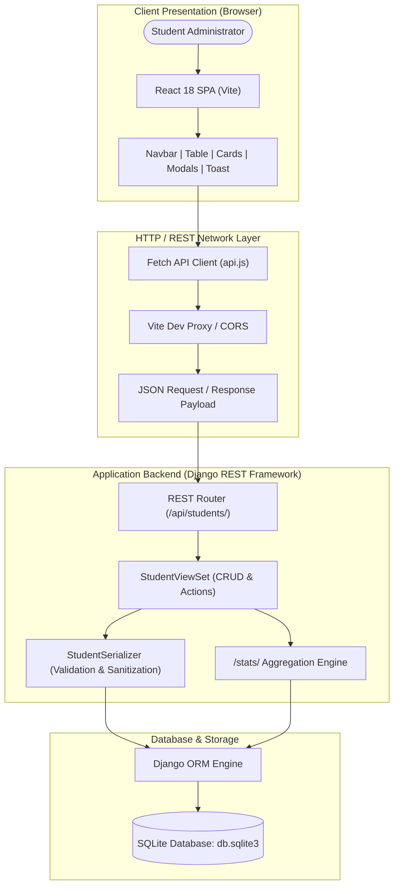
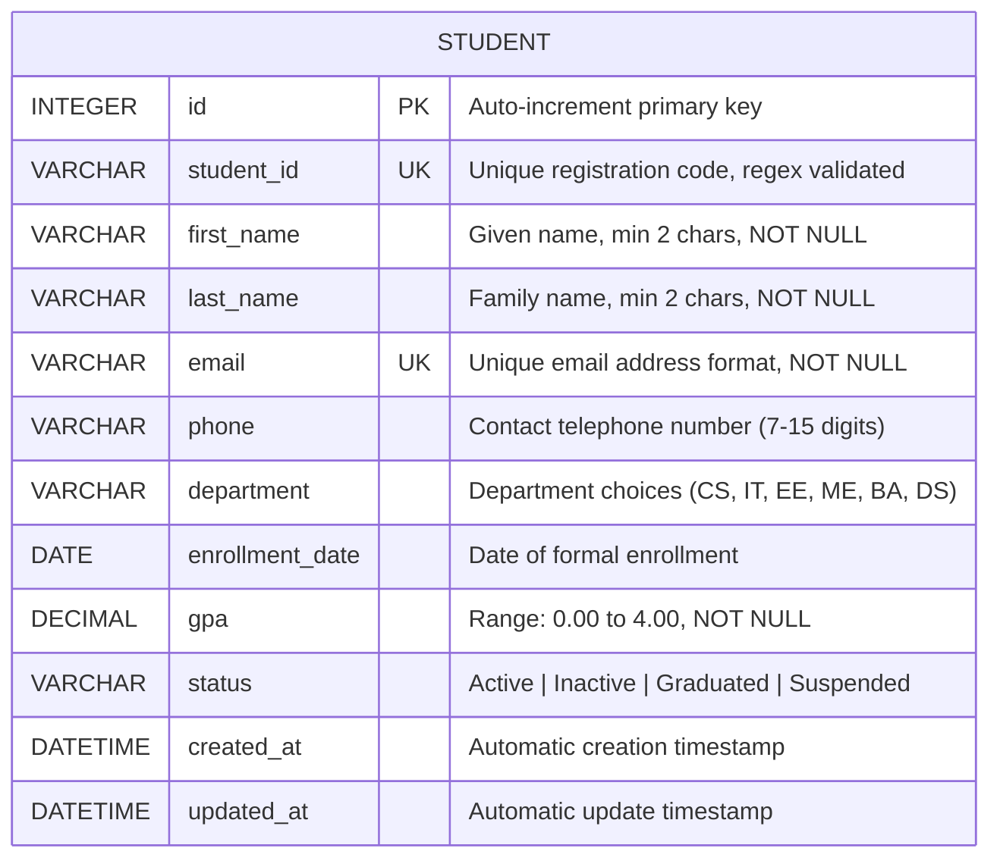

# PROJECT REPORT: EduTrack Pro
## Complete CRUD-Based Full-Stack Web Application Development
**Standard Operating Procedure (SOP) Compliant Project Report**

---

### 1. Title and Project Overview
- **Project Title**: EduTrack Pro – Comprehensive Student Management System (SMS)
- **Domain**: Academic & Institutional Management
- **Course/Subject**: Full-Stack Web Application Development
- **Implementation Architecture**: Decoupled Client-Server Full-Stack Architecture (React Frontend + Django REST Framework Backend + SQLite Relational Database)

EduTrack Pro is a production-grade, full-stack web application developed according to the academic Standard Operating Procedure (SOP). It provides institutional administrators, faculty, and academic counselors with a centralized, responsive interface to manage student academic life cycles through robust Create, Read, Update, and Delete (CRUD) operations, real-time statistical metrics, dynamic filtering, and dual-layer validation.

---

### 2. Problem Statement
Academic institutions frequently encounter challenges maintaining decentralized, inconsistent, or error-prone student records. Manual tracking or fragmented spreadsheet solutions lead to duplicate entries, invalid email formatting, unchecked GPA bounds, and delayed academic reporting. 

There is an imperative need for a secure, responsive, full-stack application that enforces strict data integrity constraints, provides seamless multi-criteria filtering, and delivers real-time analytics through RESTful service integration.

---

### 3. Objectives
1. **Full-Stack Architecture**: Implement a decoupled, responsive single-page application (SPA) backed by a robust REST API service.
2. **Complete CRUD Operations**: Deliver full Create, Read (List & Single Detail), Update (Full PUT & Partial PATCH), and Delete capabilities.
3. **Dual-Layer Validation**: Enforce strict data sanitization and constraint validation on both the client (React form state) and server (Django REST Framework serializers and model constraints).
4. **Relational Database Design**: Structure an optimized SQLite database with indexes, uniqueness constraints, and foreign-choice integrity.
5. **Quality & Testing**: Provide a comprehensive automated test suite (`APITestCase`) and a ready-to-use Postman collection covering positive, negative, and edge test scenarios.
6. **Documentation & Version Control**: Document system design, architecture, schemas, and API contracts, maintaining clean Git commit practices.

---

### 4. Technology Stack & Justification

| Layer | Selected Technology | Version | Justification |
| :--- | :--- | :--- | :--- |
| **Frontend UI** | HTML5, CSS3, JavaScript (ES6+) | Modern Web Standard | Semantic markup, responsive flexbox/grid layout, zero external heavy UI dependencies. |
| **Frontend Framework** | React + Vite | React 18.3, Vite 5.4 | Fast HMR, component reusability, declarative state management, accessible dialogs. |
| **Icons & Visuals** | Lucide React | v0.453 | Lightweight, accessible SVG icons for visual hierarchy and status cues. |
| **Backend Framework** | Django / Django REST Framework | Django 6.1, DRF 3.18 | Industry-standard Python ORM, built-in migration engine, robust serializer validation. |
| **CORS Middleware** | `django-cors-headers` | v4.9 | Clean cross-origin resource sharing between React (`:5173`) and Django (`:8000`). |
| **Database** | SQLite3 | Embedded Relational | Zero-configuration, ACID-compliant relational SQL storage ideal for academic evaluation. |
| **API Testing** | Python `unittest` / DRF `APITestCase` & Postman | Postman Collection v2.1 | Automated test runners + exportable Postman suite for interactive evaluator grading. |
| **Version Control** | Git | v2.55 | Structured commits following Conventional Commits format (`feat`, `docs`, `fix`). |

---

### 5. System Architecture



---

### 6. Database Schema & ER Diagram



#### Database Constraints Applied:
1. **Primary Key**: `id` auto-incrementing integer.
2. **Unique Constraints**: `student_id` (Unique, Case-Insensitive Check) and `email` (Unique).
3. **Check Constraints / Validators**:
   - `gpa`: `MinValueValidator(0.00)`, `MaxValueValidator(4.00)`.
   - `student_id`: `RegexValidator(^[A-Z0-9\-]{4,20}$)`.
4. **Database Indexes**: Indexed on `student_id`, `email`, `department`, and `status` for fast query performance.

---

### 7. REST API Specification

| Endpoint | HTTP Method | Purpose | Sample Request Body / Query Params | Expected Status | Response Summary |
| :--- | :--- | :--- | :--- | :--- | :--- |
| `/api/students/` | `GET` | List all records with filters | `?search=Aarav&department=Computer+Science&ordering=-gpa` | `200 OK` | Array of student objects |
| `/api/students/` | `POST` | Create new student | JSON payload containing all required student fields | `201 Created` | Created student object with generated `id` |
| `/api/students/{id}/` | `GET` | Retrieve single student | None | `200 OK` (or `404`) | Student details object |
| `/api/students/{id}/` | `PUT` | Full update | Complete JSON payload with updated fields | `200 OK` (or `400`/`404`) | Updated student object |
| `/api/students/{id}/` | `PATCH` | Partial update | Partial JSON payload (e.g. `{"status": "Graduated"}`) | `200 OK` (or `400`/`404`) | Updated student object |
| `/api/students/{id}/` | `DELETE` | Delete record | None | `204 No Content` | Empty response body |
| `/api/students/stats/` | `GET` | Analytics dashboard summary | None | `200 OK` | Total count, active, graduated, avg GPA, depts |

---

### 8. CRUD Implementation Details

#### A. Create (POST)
- **Client Side**: Administrator opens "Add Student" modal. Client validates format before submission.
- **Server Side**: `StudentSerializer` validates non-empty values, unique constraints, regex format, and numeric range. Returns `201 Created` or `400 Bad Request` with field-keyed error dictionary.
- **UI Reaction**: Instant toast notification, modal auto-dismiss, automatic table refresh, and metrics card update.

#### B. Read (GET All & GET One)
- **Client Side**: Dual presentation modes:
  - **Table View**: High-density display with sortable columns, code badges, GPA pills, and status tags.
  - **Card Grid View**: Responsive modern visual card grid ideal for mobile viewports.
  - **Detail View Modal**: Inspects complete audit timestamps, academic standing, and contact links.
- **Server Side**: `StudentViewSet.get_queryset()` handles multi-field substring queries (`Q` objects) and department/status filtering.

#### C. Update (PUT / PATCH)
- **Client Side**: Administrator clicks "Edit" button; form pre-populates with existing record values. Administrator updates fields and submits.
- **Server Side**: Serializer excludes current student record ID during uniqueness verification, preventing false-positive duplicate errors on existing records. Returns updated record with `200 OK`.

#### D. Delete (DELETE)
- **Client Side**: Modal confirmation prompt displaying target student name and ID to prevent accidental data loss.
- **Server Side**: Executes Django ORM `.delete()` and returns `204 No Content`.
- **UI Reaction**: Toast alert confirms permanent deletion; table and aggregate statistics update dynamically without full browser reload.

---

### 9. Validation & Exception Handling Matrix

| Field | Client Validation Rule | Server Validation Rule | Error Message |
| :--- | :--- | :--- | :--- |
| `student_id` | Required, alphanumeric + hyphens (4-20 chars) | `RegexValidator` & uniqueness query | "Must be 4-20 alphanumeric uppercase characters or hyphens." |
| `first_name` | Required, min 2 characters | `validate_first_name`: min 2 chars | "First name must be at least 2 characters." |
| `last_name` | Required, min 2 characters | `validate_last_name`: min 2 chars | "Last name must be at least 2 characters." |
| `email` | RFC 5322 regex match | `EmailField` + case-insensitive unique query | "The email address is already in use by another student." |
| `phone` | 7 to 15 digits requirement | Digits length check (7-15) | "Phone number must contain between 7 and 15 digits." |
| `gpa` | Numeric, `0.00 <= val <= 4.00` | `MinValueValidator(0.00)`, `MaxValueValidator(4.00)` | "GPA must be within the range 0.00 to 4.00." |
| `department` | Non-empty selection | Validated against `DEPARTMENT_CHOICES` | "Select a valid choice." |
| `status` | Non-empty selection | Validated against `STATUS_CHOICES` | "Select a valid choice." |

---

### 10. Automated Testing Results

Automated tests executed via Django Test Runner (`python manage.py test students`):

```
Creating test database for alias 'default'...
.................
----------------------------------------------------------------------
Ran 17 tests in 0.183s

OK
Destroying test database for alias 'default'...
Found 17 test(s).
System check identified no issues (0 silenced).
```

#### Test Cases Implemented:
1. `test_create_student_success`: Asserts 201 Created and verifies database persistence.
2. `test_create_student_missing_required_fields`: Asserts 400 Bad Request with field errors.
3. `test_create_student_duplicate_student_id`: Asserts rejection of duplicate registration ID.
4. `test_create_student_duplicate_email`: Asserts rejection of duplicate email address.
5. `test_create_student_invalid_email_format`: Asserts rejection of malformed email strings.
6. `test_create_student_invalid_gpa_range`: Asserts rejection of GPAs < 0.00 and > 4.00.
7. `test_read_all_students_empty_database`: Asserts empty list `[]` with 200 OK.
8. `test_read_all_students_populated_database`: Asserts array of records with 200 OK.
9. `test_read_single_student_valid_id`: Asserts 200 OK and matching record properties.
10. `test_read_single_student_invalid_id`: Asserts 404 Not Found on missing ID.
11. `test_update_student_full_put`: Asserts 200 OK and verifies updated values in database.
12. `test_update_student_partial_patch`: Asserts partial field modification with 200 OK.
13. `test_update_student_invalid_id`: Asserts 404 Not Found on updating non-existent record.
14. `test_delete_student_success`: Asserts 204 No Content and confirms removal from database.
15. `test_delete_student_invalid_id`: Asserts 404 Not Found on deleting non-existent ID.
16. `test_search_and_filter`: Asserts substring search and department filtering accuracy.
17. `test_stats_endpoint`: Asserts aggregation logic for total count, active count, and average GPA.

---

### 11. Installation & Execution Guide

#### Prerequisites:
- Python 3.10+ (Python 3.12 configured)
- Node.js 18+ (Node.js 20 LTS configured)
- Git

#### Quick Start (Dual Terminals or Batch Scripts):

**Option A: Using Convenience Scripts (Windows)**
1. Launch Backend: Double click `run_backend.bat` (starts Django at `http://127.0.0.1:8000`).
2. Launch Frontend: Double click `run_frontend.bat` (starts Vite React at `http://127.0.0.1:5173`).
3. Open your web browser to `http://localhost:5173`.

**Option B: Manual Terminal Execution**

*Terminal 1 - Backend:*
```powershell
# Navigate to backend directory
cd backend

# Run migrations (already generated)
..\.venv\Scripts\python.exe manage.py migrate

# Seed sample data (optional, creates 8 demonstration records)
..\.venv\Scripts\python.exe manage.py seed_students

# Start development server
..\.venv\Scripts\python.exe manage.py runserver 127.0.0.1:8000
```

*Terminal 2 - Frontend:*
```powershell
# Navigate to frontend directory
cd frontend

# Install dependencies (already initialized)
npm install

# Start development server
npm run dev
```

---

### 12. Evaluation Rubric Compliance Checklist

| Component | Weight | SOP Criteria | Implementation Evidence |
| :--- | :---: | :--- | :--- |
| **Requirement & Design** | 10% | Problem definition, architecture, ER diagrams | Detailed in Section 2, 5, 6 with Mermaid diagrams. |
| **Frontend** | 20% | UI quality, responsiveness, forms, validation | Modern React SPA, table/card switcher, responsive CSS, live validation. |
| **Backend & API** | 20% | REST APIs, business logic, validation | Django REST Framework ModelViewSet, custom serializers, `/stats/` endpoint. |
| **CRUD Functionality** | 20% | Create, Read, Update, Delete working | All 4 operations functional in UI, API, and database with live tests. |
| **Database** | 10% | Schema, constraints, connectivity, integrity | SQLite `Student` model with unique indices, range validators, and choice enums. |
| **Testing** | 10% | Test coverage and error handling | 17 automated unit/integration tests passed + Postman collection. |
| **Documentation & Viva** | 10% | Report quality and project explanation | Complete documentation report + Viva questions below. |

---

### 13. Viva-Voce Questions & Answers Guide

**Q1: What is the purpose of Django REST Framework Serializers?**
> *Answer*: Serializers convert complex Django model instances into native Python datatypes that can be rendered into JSON for HTTP transmission. In reverse, they validate and sanitize incoming deserialized JSON request bodies before saving to the database.

**Q2: How does EduTrack Pro prevent duplicate registrations?**
> *Answer*: Uniqueness is enforced at two distinct levels: (1) Database level via `unique=True` on `student_id` and `email`, creating unique index constraints in SQLite; and (2) Serializer level via custom `validate_student_id` and `validate_email` methods, which query existing records and supply clear user-friendly error messages.

**Q3: How are CORS issues handled between React (:5173) and Django (:8000)?**
> *Answer*: The backend integrates `django-cors-headers` middleware placed before Django's `CommonMiddleware`. Additionally, the Vite configuration contains a reverse proxy under `/api` that transparently forwards requests to `http://127.0.0.1:8000`.

**Q4: What is the difference between PUT and PATCH methods in your API?**
> *Answer*: `PUT` replaces the entire student resource with all mandatory fields supplied in the request body. `PATCH` applies a partial update, modifying only the fields provided (e.g. updating only `status` from "Active" to "Graduated") while leaving other attributes unchanged.

**Q5: How does the application prevent accidental data deletion?**
> *Answer*: Instead of immediately issuing a DELETE request upon clicking the trash icon, the UI triggers a dedicated `DeleteConfirmModal` presenting the target student's name, ID, and department with explicit warning context, requiring user confirmation before sending the `DELETE /api/students/{id}/` request.
